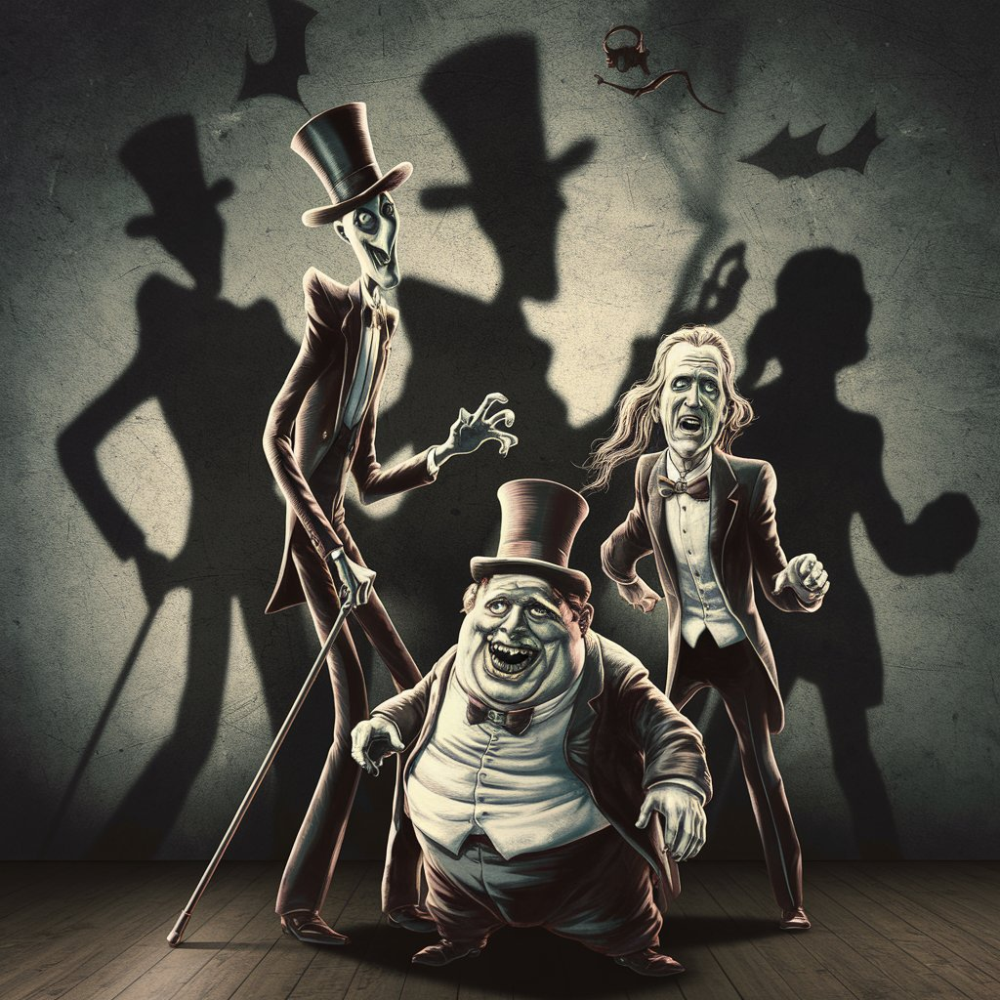

# Dance of the Shadows

[Back Home](/)

[Suno](https://suno.com/create) 
Suno was used to create music

[Ideogram](https://ideogram.ai/t/explore)
Ideogram was used for images

Song: [Dance of the Shadows](https://drive.google.com/file/d/1mqkFTtvDXx0DKOFJBtBXyY8HOqg2GRog/view?usp=drive_link)

Lyrics:

[Verse]
In the shadows where the whispers play
Midnight's cloak hides what hearts will sway
Lurking in the twilight silent so bold
I'm the thief of souls in tales untold

[Verse 2]
Footsteps echo on the cobblestone
Empty alleyways where lost ones roam
Eyes glow crimson behind the curtain's fold
Reaching out to snatch the unwary soul

[Chorus]
Dance with me into the void so deep
Secrets you keep will be mine to reap
Darkened alleys where the shadows creep
In the night where all the lost souls weep

[Verse 3]
Moonlight glints off a silent scream
In the labyrinth where the torches gleam
Wraiths of the night by my side they lean
Together we steal dreams unseen

[Bridge]
Candles flicker as the cold winds rise
Unseen forces under darkened skies
Your essence captured in my empty eyes
Lost forever where the silent lies

[Chorus]
Dance with me into the void so deep
Secrets you keep will be mine to reap
Darkened alleys where the shadows creep
In the night where all the lost souls weep
