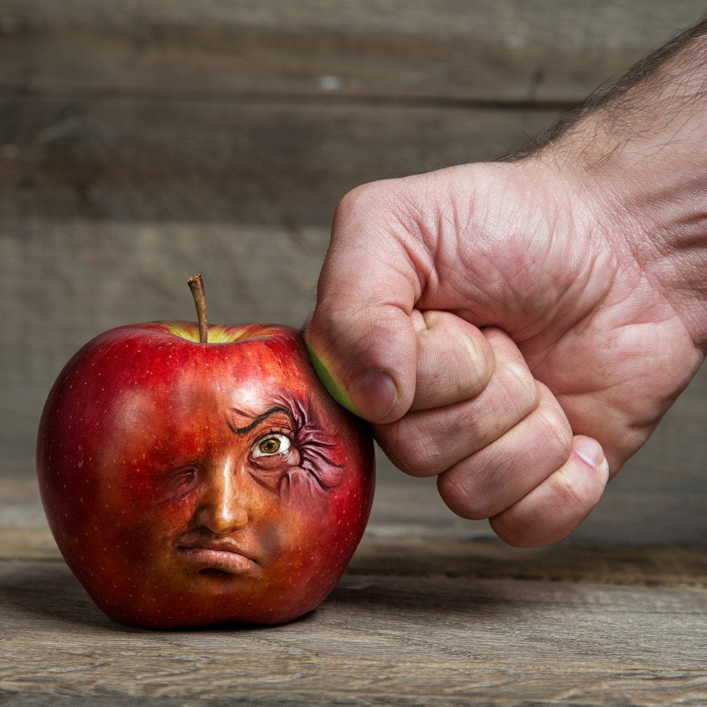

# Darn You Sugar

[Back Home](/)

[Udio](https://www.udio.com/home)
Used only this song

[Ideogram](https://ideogram.ai/t/explore)
Ideogram was used for images

Song:[Darn You Sugar](https://drive.google.com/file/d/1sExrOm0uhIToD0VqQR0y_otNSeAWQCMK/view?usp=sharing)

Lyrics:

[Verse]
Darn you sugar for rotting my teeth
I'm going to send you 6 feet underneath
Cavities forming, drilling in the night
Gotta protect, no more sweet delight
[Chorus]
Rotten sugar decay, get out of my way
A dentist's dismay, but I'll fight today
No more sugar lies, with your candy eyes
Teeth strong like steel, beneath bluer skies

[Verse 2]
Oh, sugar craving, you won't win this fight
I'll lock you away, out of my sight
Toothbrush and paste, they become my shield
No more surrender, no more I'll yield

[Bridge]
Every sweet promise, you're just a sly thief
Darn you sugar for rotting my teeth,
I'm going to send you 6 feet underneath
In this battle of health, I find my relief

[Chorus]
Rotten sugar decay, get out of my way
A dentist's dismay, I won't let you sway
No more syrupy dreams, sugary visions
Teeth fortified with healthy decisions
[Verse 3]
Darn you sugar for making life bitter
Your sweet allure is like glitter and litter
But I'm taking charge, no more you'll deceive
In this smile of mine, only health I'll achieve
[Outro]
Goodbye to sweet traps that lure in deceit
My enamel strong, your lies I defeat
[Verse 3]
Oh, candy whispers in the grocery aisle
Your colorful gleam is fleeting, tempting and vile
But this time I'll stand, against your sweet charms
For in every bite, you bring only harm
[Bridge]
Darn you sugar for the pain you compose
Your sweetest tunes turn merry to woes
I'm taking back control, reclaiming my peace
As sugary chains break, I'm finally released
[Chorus]
Rotten sugar decay, step aside, let me breathe
To health and fresh smiles, I now cleave
darn you Sugar for rotting my teeth
I'm going to send you 5 feet underneath
Darn you Sugar
For making life bitter
