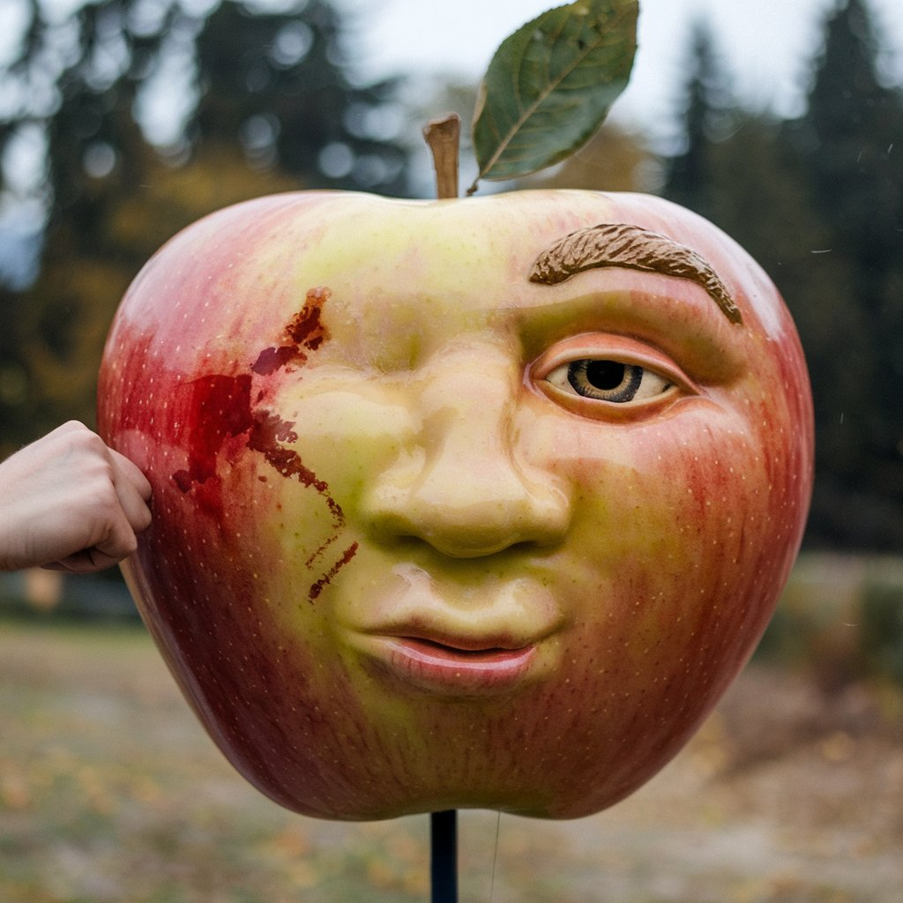

# Fighting Food

Song: [Punching Apples in the Face](https://drive.google.com/file/d/1SauveFRGqGu4ztQtBmU7wh2eZgAvTjRa/view?usp=sharing) | [Page ->]()

Song:  | [Page ->]()

Song:  | [Page ->]()

Song(used udio):[Echoes of Ashes](https://drive.google.com/file/d/1G23nBlPcVLhwfOgosnZPOuvZxS8LgBXC/view?usp=sharing) | [Page ->](Echoes-of-Ashes.md)

## Sources

[Poe](https://poe.com/) 
Poe was used for researching how to do certain code

[Suno](https://suno.com/create) 
Suno was used to create most of the music (except echoes of ashes)

[Ideogram](https://ideogram.ai/t/explore)
Ideogram was used for images

[Udio](https://www.udio.com/home)
Used this for the Echoes of Ashes song

[Prompts and Comments Page ->](Prompts-Used-and-Comments.md)
