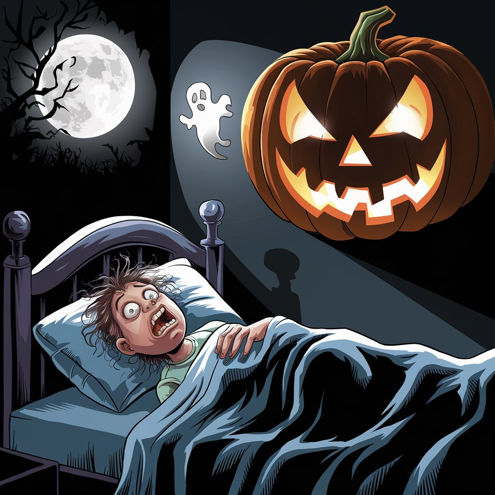

# Halloween Dream

[Back Home](/)

Song: [The Traveling Pumpkin](https://drive.google.com/file/d/1Apvn7q-HrULpkKKkxR3gTiku2VQv3SmI/view?usp=drive_link) | [Page ->](The-Traveling-Pumpkin.md)

Song: [Dance of the Shadows](https://drive.google.com/file/d/1mqkFTtvDXx0DKOFJBtBXyY8HOqg2GRog/view?usp=sharing) | [Page ->](Dance-of-the-Shadows.md)

Song: [Monsters in the Night](https://drive.google.com/file/d/1SGqms5xLoYtsqf3Jx4TnY6y8Fo-6l_bK/view?usp=sharing) | [Page ->](Monsters-in-the-Night.md)

Song:[Who's the Host](https://drive.google.com/file/d/1k7ivM8JUdxGmrDJJbnSx1HHedpGlgw0I/view?usp=drive_link) | [Page ->](Who's-the-Host.md)

## Prompts and Comments

(What went into creating each song)

[Prompts and Comments Page ->](Prompts-Used-and-Comments.md)

## Sources

[Poe](https://poe.com/) 
Poe was used for researching how to do certain code

[Suno](https://suno.com/create) 
Suno was used to create most of the music (except echoes of ashes)

[Ideogram](https://ideogram.ai/t/explore)
Ideogram was used for images

[Udio](https://www.udio.com/home)
Used this for music

[Prompts and Comments Page ->](Prompts-Used-and-Comments.md)
