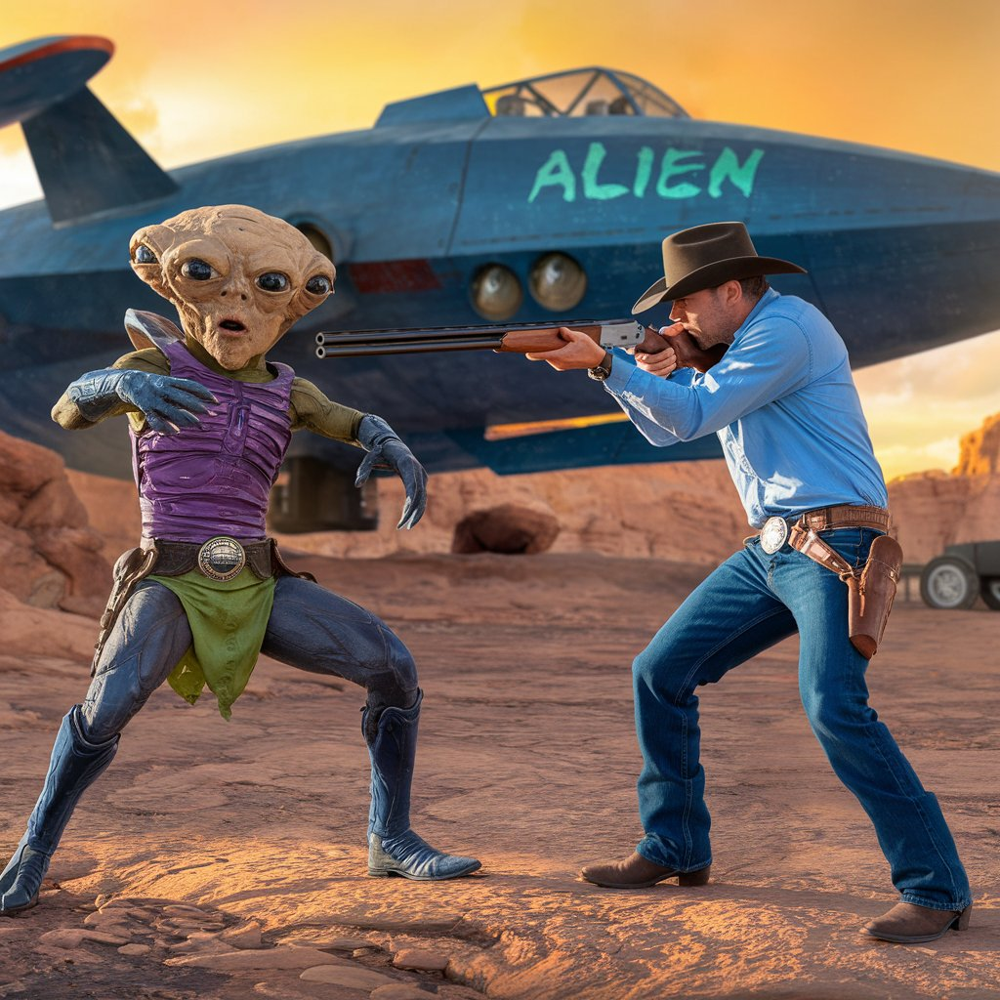

# Honky-Tonk-Extraterrestrial

Song: [Honky Tonk Extraterrestrial](https://drive.google.com/file/d/1k843hZ9vtPoM9ccWjW0HjjKDQ6Vcp_Lf/view?usp=sharing)

Lyrics: [Verse]
Under the starry sky on a dusty old farm,
There's a country boy known for his charm,
But when night falls, in the twinkle of light,
He gears up to wage a cosmic fight.

[Verse 2]
With his truck and his dog, he's ready to go,
Plowing through fields where the corn starts to grow,
He ain't scared of critters from outer space,
He's got his shotgun and a steely grace.

[Chorus]
He's a honky-tonk extraterrestrial,
Fighting aliens way out west'rn celestial,
From the barn to the field, to the midnight horizon,
This country boy won't be anonymizin'.

[Verse 3]
Every night you hear the tractor's hum,
Alone on the frontlines, he ain't gonna run,
Cornfield camouflage and a rebel's pride,
In the battle against 'em, he's bona fide.

[Verse 4]
Martians and saucers come down from the stars,
But they're no match for this country's jagged scars,
He's got the heart and he's got the grit,
Ain't no space critter he's gonna let slip.

[Chorus]
He's a honky-tonk extraterrestrial,
Fighting aliens way out west'rn celestial,
From the barn to the field, to the midnight horizon,
This country boy won't be anonymizin'.

[Suno](https://suno.com/create) 
Suno was used to create music
