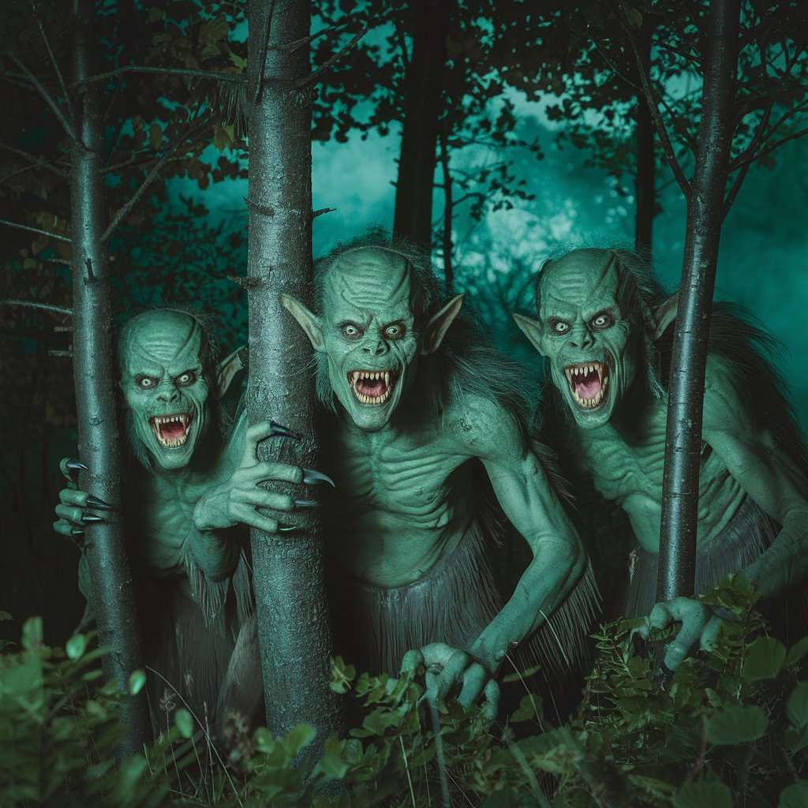

# Monsters in the Dark

[Back Home](/)

[Suno](https://suno.com/create) 
Suno was used to create music

[Ideogram](https://ideogram.ai/t/explore)
Ideogram was used for images

Song: [Monsters in the Dark](https://drive.google.com/file/d/1SGqms5xLoYtsqf3Jx4TnY6y8Fo-6l_bK/view?usp=sharing)

Lyrics:

[Verse]
Midnight whispers echo through the bones
Shadows crawling
Gravel in their tones
Eyes like ember
Hunger left to roam
In the dark
Monsters find their home

[Verse]
Withered hands that stretch like twisted vines
Broken laughter laced with ancient signs
Hollow hearts that beat like haunted chimes
In the night
Terror intertwines

[Chorus]
Monsters in the night
Where do you go?
Feasting on the fear
Tales in shadows
Lurking in the dark
Where nightmares grow
Monsters in the night
Enough to choke the soul

[Verse]
Jagged teeth that glint with sordid thirst
Breath like winter
Whispers unrehearsed
Footsteps echo doom in raven’s verse
In the black
Monsters do their worst

[Bridge]
What’s that rustling just beyond the bed?
Words unspoken fill the mind with dread
Fingers curling
Tapping full of lead
Monsters in the mind
What lies ahead?

[Chorus]
Monsters in the night
Where do you go?
Feasting on the fear
Tales in shadows
Lurking in the dark
Where nightmares grow
Monsters in the night
Enough to choke the soul
