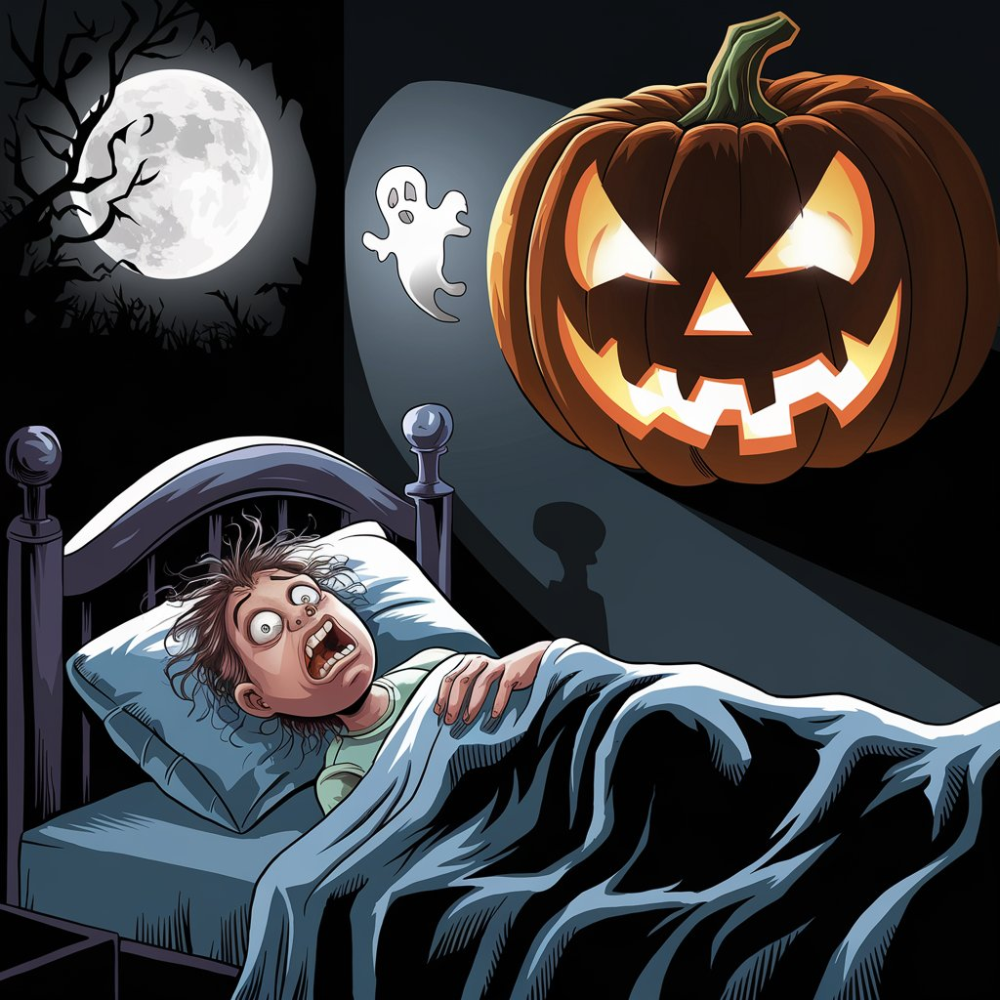

# John-s-AI-Music-Albums
Making Albums that contain AI Music and AI art

## Test the Album

[Test the Album ->](Test-Album.md)
Songs:
Honky Tonk Extraterrestrial,
Crying Over Spilled Milk,
Autumn Glow,
Echoes of Ashes

## Fighting Food

[Fighting Food ->](Fighting-Food.md)
Songs:
Punching Apples in the Face, Celery Samurai, Darn You Sugar,The Passing of Food

## Halloween Dream

[Halloween Dream ->](Halloween-Dream.md)

Songs: The Traveling Pumpkin, Dancing of the Shadows, Monsters in the Night, Who's the Host?

## Sources

[Poe](https://poe.com/) 
Poe was used for researching how to do certain code

[Suno](https://suno.com/create) 
Suno was used to create most of the music (except echoes of ashes)

[Ideogram](https://ideogram.ai/t/explore)
Ideogram was used for images

[Udio](https://www.udio.com/home)
Alternate for creating songs

[Prompts and Comments Page ->](Prompts-Used-and-Comments.md)
