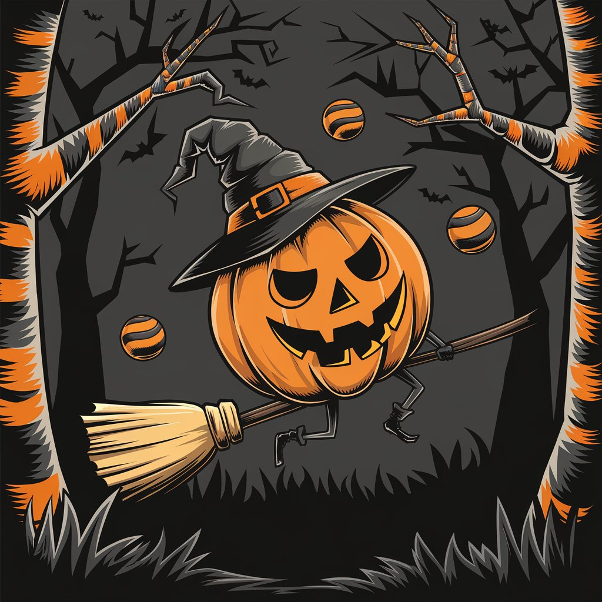

# The Traveling Pumpkin

[Back Home](/)

[Udio](https://www.udio.com/home)
Used only this song

[Ideogram](https://ideogram.ai/t/explore)
Ideogram was used for images

Song:[The Traveling Pumpkin](https://drive.google.com/file/d/1Apvn7q-HrULpkKKkxR3gTiku2VQv3SmI/view?usp=drive_link)

Lyrics:

[Verse 1]
Travelin' pumpkin, oh, travelin' gourd
Rolls o'er the hills with a grumbling roar
Candy for children who do as they're told
But terrors await for the naughty and bold

[Chorus]
Oh, pumpkin's coming, land to land
Sweet treats or shivers, close at hand
[Verse 2]
Through foggy nights and moonlit trails
The pumpkin rolls, tells eerie tales
Watch those shadows, watch those lights
For the pumpkin watches on restless nights

[Chorus]
Oh, pumpkin's coming, hear its wail
To those who tremble, pale and frail
With sweet rewards or chilling fear
The travelin' pumpkin draws near
[Verse 3]
In every town, its whispers spread
From pumpkin eyes, a glow of dread
For those who listen close in the night
Hear tales of fright from its gentle light
[Bridge]
Listen, children, to the ground
Feel the rumble, hear the sound
It draws near with a laugh or moan
Heed the calls, or face it alone
[Chorus]
Oh, pumpkin's coming, land to land
Sweet treats or shivers, close at hand
[Verse 4]
The scarecrows watch and the winds hold breath
As the pumpkin rolls with whispers of death
Lanterns flicker, casting haunting glow
In its path, secrets that only children know
[Chorus]
Oh, pumpkin's coming, shadows loom
Good kids be merry, in the mystery's bloom
For in each roll and groan of wheels
Lurks the truth of what the pumpkin reveals
[Outro]
